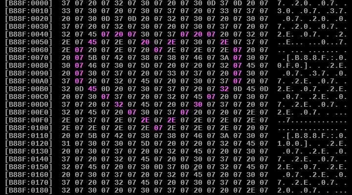

Mebby is an x86 Memory Editor that fits in the Boot sector.



It can be used to inspect and edit memory, as well as execute x86 machine code anywhere in memory.

## How to build

Mebby can be assembled using the [Netwide Assembler (NASM)](https://www.nasm.us/) with the following command:
```
nasm -f bin mebby.asm
```
This repository also contains a prebuilt binary.

## How to run

You can try Mebby out by loading it as a floppy disk image on the [v86 emulator](https://copy.sh/v86/).

Mebby is as of yet untested on actual hardware.
